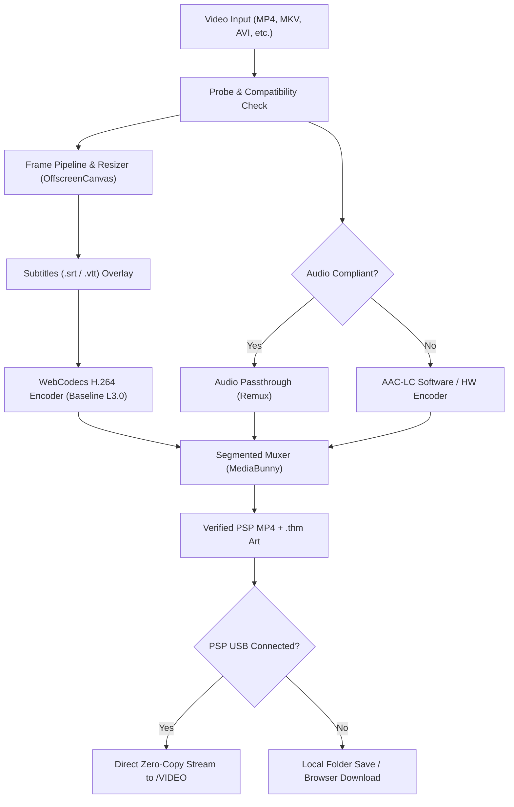

# 🎮 PSP Video Converter Web

[](LICENSE)
[](https://bun.sh)
[](https://github.com/Vanilagy/mediabunny)
[](https://tanstack.com/start)
[](https://tailwindcss.com)
[](https://oxc.rs)

> High-performance, 100% in-browser video converter built for the **Sony PlayStation Portable** (PSP 1000, 2000, 3000, PSP Go, and Street).
> Drag and drop modern videos (MKV, MP4, AVI, MOV, WEBM) and get PSP-ready MP4s with matching `.thm` cover art, saved **directly to your connected PSP over USB** — zero server uploads required.

---

## ✨ Features

- **🚀 100% Client-Side Transcoding**: Powered by **WebCodecs** and **MediaBunny**. Your videos never touch a remote server; all decoding, scaling, subtitle rendering, and encoding happen directly in your browser.
- **⚡ Hardware Accelerated & Multi-Core**:
  - Leverages Apple Silicon (VideoToolbox), Intel QuickSync, and NVIDIA NVENC hardware encoders.
  - Multi-threaded segmented pipeline (`SegmentedMuxer`) encodes video chunks in parallel across CPU performance and efficiency cores.
  - AAC-LC audio remuxing: When audio is already compliant, it bypasses re-encoding for instant remux speeds.
- **🔌 Automatic PSP USB Detection**:
  - Automatically identifies connected PSP devices over USB (including multi-partition setups like PSP Go internal 16 GB eMMC + M2 Memory Stick).
  - Streams converted videos directly to the PSP's `/VIDEO` directory with zero manual copying.
- **🛡️ Intelligent Anti-Duplication**:
  - Scans PSP storage before encoding starts.
  - Configurable conflict actions for existing titles: **Skip**, **Replace existing**, or **Keep both** (auto-versioned).
- **📁 Built-in PSP Storage Manager**:
  - Visual storage gauge showing real-time disk space usage and free capacity.
  - Browse all videos stored on the PSP with live `.thm` cover art thumbnails.
  - Instant live search and multi-criteria sorting (Newest, Oldest, Largest, Smallest, Name).
  - Zero-copy inline renaming and two-step confirmation deletion.
- **🖼️ Automatic Cover Art Generation**:
  - Automatically captures and scales a 160×120 JPEG `.thm` thumbnail directly embedded for the PSP XMB video browser.
- **💬 Subtitle Burning**:
  - Supports `.srt` and `.vtt` subtitles baked directly onto the video stream with auto-scaling typography.
- **🎨 Modern UI**:
  - Built with **TanStack Start**, **Tailwind CSS v4**, **Base UI / shadcn**, and **Hugeicons**.

---

## 🎯 PSP Compatibility Specifications

Every output MP4 is strictly verified against Sony's hardware playback constraints:

| Specification   | Hardware Limit / Target             | Converter Implementation                                             |
| :-------------- | :---------------------------------- | :------------------------------------------------------------------- |
| **Video Codec** | H.264 / AVC                         | Forced Constrained Baseline Profile (`avc1.42E01E`)                  |
| **AVC Level**   | Level 3.0 or below                  | Level 3.0 strictly enforced via direct MP4 `avcC` box validation     |
| **Resolution**  | 480×272 (Native) / 720×480 (TV-out) | Auto-fitted with letterboxing or integer aspect scaling              |
| **Framerate**   | ≤ 29.97 fps (30000/1001)            | Pre-transform skipping for high-fps (e.g. 60fps) sources             |
| **Audio Codec** | AAC-LC (`mp4a.40.2`)                | 44.1 kHz or 48 kHz stereo / mono, 64–192 kbps                        |
| **Container**   | ISO Base Media File (MP4)           | Non-fragmented MP4 with faststart (`moov` atom placed before `mdat`) |
| **Thumbnail**   | 160×120 JPEG                        | Created as `<name>.thm` alongside `<name>.mp4`                       |

---

## 🏗️ Architecture



---

## 🚀 Getting Started

### Prerequisites

- [Bun](https://bun.sh) (v1.1+) or Node.js (v20+)
- Modern Chromium or WebCodecs-compatible browser (Chrome, Edge, Brave, Arc, Opera)

### Installation

```bash
# Clone the repository
git clone https://github.com/sabraman/psp-video-web.git
cd psp-video-web

# Install dependencies
bun install
```

### Running Locally

```bash
# Start Vite development server with PSP USB detector
bun run dev
```

Open [http://localhost:3005](http://localhost:3005) in your browser.

Connect your PSP via USB, set the USB Connection mode in the PSP XMB menu, and the converter will automatically detect your device partitions and free storage!

### Building for Production

```bash
# Build worker and client bundle
bun run build

# Preview production build
bun run preview
```

### Code Quality

```bash
# Typecheck
bun run typecheck

# Lint with oxlint
bun run lint

# Format with oxfmt
bun run format
bun run format:check
```

---

## 🎮 PSP Tested Devices

- **PSP Go (PSP-N1000)**: Internal 16GB eMMC (`NO NAME 1`) and M2 Memory Stick Micro (`NO NAME`).
- **PSP 1000 / 2000 / 3000 / Street (E1000)**: Memory Stick PRO Duo partitions.

---

## 📄 License

MIT © [sabraman](https://github.com/sabraman)
